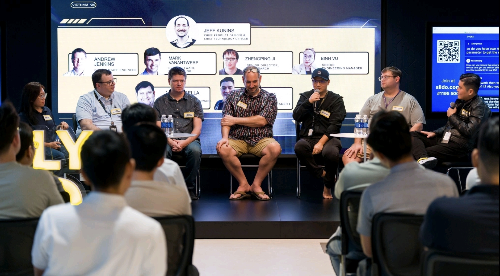
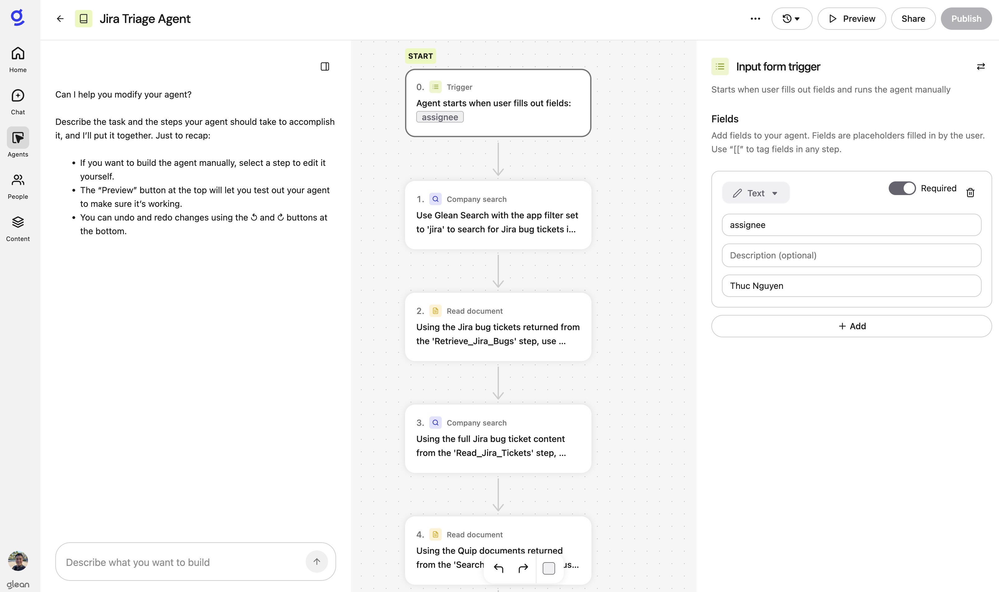

At Axon’s Company Kickoff week in January 2026, we ran multiple AI events back-to-back. Two of which fundamentally changed how I think about AI.

The first was **Axon Tech Summit**, where I had the chance to MC a AMA panel with Axon leaders including [Jeff Kunins (CPO/CTO)](https://www.axon.com/leadership/jeff-kunins), [Mark VanAntwerp (SVP of Engineering)](https://www.linkedin.com/in/mark-vanantwerp/) and other senior engineering/AI leaders. The theme was:

- AI in everything we build  
- build everything *with* AI  
- the risk of adopting AI vs. the risk of not adopting it  

Our audience was senior engineers, staff engineers, architects, director of engineering from local tech companies like Nvidia Vietnam, NAB, and Ninja Van. Several candidates applied on the spot.

The second was an internal **AI Hackathon**, where I was exposed — for the first time — to the idea of a *fleet of AI agents* and tools like **Claude Code** operating directly on real codebases.

What struck me wasn’t just the technology.

It was the **energy**.

People weren’t excited about prompts or chatbots. They were excited about *velocity* — about removing entire categories of work that slow teams down.

That week became the catalyst for my latest exploration of AI — not as a novelty, but as a way to fundamentally redesign how I work as a product manager.

---

## AI-assisted vs. AI-first

Product managers often use *“AI-assisted”* and *“AI-first”* interchangeably.  
They are not the same thing.

- **AI-assisted** means AI helps you do the same work a bit faster.
- **AI-first** means you redesign the system so the work often doesn’t need to be done by a human at all.

This post is about the second approach.

What follows is a **concrete, end-to-end AI-first PM workflow** I use in a real enterprise environment — across bug triage, product discovery, prototyping, and delivery.

It includes what worked, what failed, and where human judgment still cannot be replaced.

If you’re a PM wondering *where AI actually fits into day-to-day work*, this is the practical version.

---

## My AI-first PM workflow

### 1. Bug triage as an autonomous agent

Bug triage is necessary — and brutally expensive in cognitive load.

I built a bug-triage agent using [Glean](https://www.glean.com/) that:

- queries customer-reported tickets in JIRA
- performs enterprise search across Quip, SharePoint, Jira, and Slack
- retrieves relevant known issues, similar past bugs, and troubleshooting steps
- proposes the next best action: request reproducible steps, ask for artifacts (HAR, audit trails), provide a useful advice to support engineers, route to the correct team

Instead of reacting to every ticket, I now review **decisions**. 

The agent does the digging. I apply my judgment. 
That’s what *AI-first* looks like in practice.

### 2. Product discovery with AI as a research accelerator

There is still no substitute for direct customer interaction. I believe that deeply.

What AI *has* changed is how well-prepared I am *before* those conversations.

I use GPT-5.2 Pro in "deep research" mode to:
- simulate interviews with domain experts (e.g. "you are an investigator at London Metropolitan Police Service investigating an incident where a person was shot by a police officer, let me interview you")
- crawl Reddit for real-world incidents and public reactions
- propose top 5 features then have GPT-5.2 Pro debate 20 times with itself to ruthlessly prioritize them 
- retrieve historical VOC from internal knowledge bases
- sanity-check specs and architectures using Glean

The result isn’t AI-designed products.  
It’s better hypotheses, sharper questions, and higher-quality conversations with real customers.

### 3. Prototyping that engineers actually take seriously

AI has radically compressed my path from idea to something runnable.

My flow looks like this:

- rapid throwaway prototypes using [Figma Make](https://www.figma.com/ai/)
- export HTML/CSS/JS from Figma Make to a local git repository
- refine the prototype via [Claude Code CLI](https://docs.anthropic.com/en/docs/claude-code/setup) in [Cursor](https://www.cursor.com/), Visual Studio Code with [Copilot](https://github.com/features/copilot), and [Antigravity](https://antigravity.google/) with [Gemini 3 Pro](https://deepmind.google/technologies/gemini/)
- integrate the prototype directly into axon-ui, using Axon's official UI components and design tokens
- run a local dev server hosting the above code against a real [Evidence.com](https://www.evidence.com/) instance with real video evidence

Engineers don’t get a figma fantasy.
They get working code in a GitHub branch they can explore.

That changes the conversation.

**Key takeaway:** 
> Vibe coding only works when you can describe systems succinctly. 
> If you can’t explain it, AI can’t build it.

### 4. Delivery: using AI to navigate legacy complexity

Legacy codebases are where productivity goes to die.

I regularly use Claude to:

- explain legacy code left undocumented by the previous owners
- trace legacy UI flows to understand how the app works
- fix low-hanging UI bugs safely

This doesn’t replace engineers.
It lets me meet them closer to their level, faster.

<!-- image here -->

---

## When AI failed me (and why that mattered)

AI is not magic. I learned this the hard way.

I once asked Claude to re-implement an entire vibe-coded prototype as a new page inside axon-ui.

It failed spectacularly.

The app crashed on load. After 2 days of debugging with no success, I reverted everything and started over — this time:

- creating a new page from scratch  
- adding `axon-ui` components incrementally  
- fixing console errors one by one  
- validating each step locally before pushing to GitHub Enterprise 

The lesson was clear:

> AI doesn’t have enough context to safely modify systems with millions of code lines and thousands of dependencies.

Vibe coding only works when *you* understand the architecture well enough to guide it.

Speed without architectural understanding turns into fragility.

---

## What being AI-first actually means for PMs

Most PMs don’t struggle with AI because they lack tools.

They struggle because they think it's "just a chatbot".

AI *should* aggressively eliminate:
- repetitive procedural work  
- data synthesis and retrieval  
- tasks that consume senior attention without requiring senior judgment  

AI should **not** replace:
- customer conversations  
- judgment calls  
- ambiguous decision-making  

Those remain human.

The biggest risk for PMs isn’t “AI taking your job.”  
It’s having a role that **cannot be meaningfully AI-accelerated**.

Being AI-first doesn’t mean 'chat with GPT more'.

It means constantly asking:
- *Should a human still be doing this?*
- *If not, how do I make this disappear permanently?*

I don’t want AI replacing my judgment.  
I want AI protecting it.

That’s the real advantage.

AI doesn’t replace product thinking — it **amplifies** it.  
And in complex systems, reclaimed time — applied with judgment — is everything.