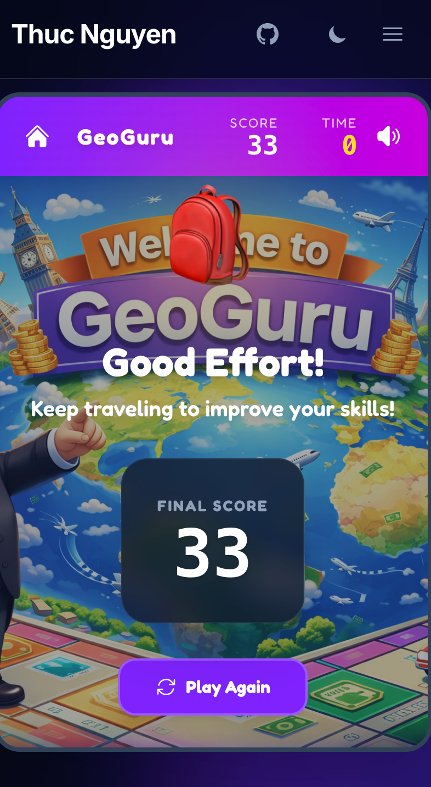

My childhood friend **Thuan Ho** and I used to have a lot of fun playing flag guessing games back in elementary school. So in college during a school project, Thuan and I built GeoGuru using the 'top-notch' tech stack at that point: WPF and .NET. It was fun and we got 10/10 for the project. 

We never thought of it ever since. But this weekend, during a casual walk-down-memory-lane conversation with Thuan, I decided to test a hypothesis: **Can an AI-first workflow resurrect GeoGuru and turn it into a shipped product in hours, not a whole semester?**

The result is mindblowing. AI helped me get it up and running in one morning. **[GeoGuru](/game)** is a rapid-fire flag guessing game that lives right here on my site.

  <a href="/game" class="inline-block px-8 py-4 bg-gradient-to-r from-violet-600 to-fuchsia-600 text-white text-xl font-black rounded-2xl shadow-lg hover:-translate-y-1 transition-transform no-underline">
    🎮 Play GeoGuru Now
  </a>

But the text-to-code dream isn't magic, it's a dialogue. Here's a look at the real journey, the snags I hit, and how I solved them.

## 1. The "Easy" Logic Trap
I started out with ChatGPT to check whether static HTML sites based on Astro can host this game. Good news! It is. ChatGPT also gave me a perfect Monopoly-styled game image, and recommendations on where to download open-source soundtracks as well as flag images to breathe life to the game.

My initial prompt for Antigravity+Gemini3Pro was rather simple: *"Build a flag guessing game but keep the code cleanly separated from existing blogs posts and image assets"* The AI obliged, writing a script to fetch 250+ country flags, randomize the question, calculate the score and end with a stage-clear screen celebrating users' achievement. 

**The Problem**: Randomness is brutal. My first test run gave me *south Georgia and the South Sandwich Islands*, followed by *Kiribati*. I scored 0. It wasn't fun; it was a geography exam.

**The Fix**: I had to engineer "fun". I implemented a **Difficulty Progression** feature:
- **The "Easy Set"**: The first 3 questions now *always* pull from a curated list of ~40 recognizable countries (USA, Japan, France, Vietnam, etc.). I didn't have to tell AI which ones are easy. It automatically selected and labeled them.
- **Progression**: Only after proving yourself (3 correct answers) does the game unlock the full world map with much harder questions.

This small logic tweak changed it from a frustrating quiz to an addictive loop.

## 2. Mobile Fails & "Liquid" UIs
I wanted the game to look "premium"—glassmorphism, vibrant gradients, 3D buttons. The AI generated beautiful Tailwind code for desktop.

**The Snag**: On mobile, it was a disaster.  
The "Start" button was unclickable. The "Mute" toggle was pushed off-screen. The background image cropped awkwardly, hiding the cute 3D globe assets.

**The Fix**: We had to get into the weeds of responsive design.
- **Dynamic Sizing**: We shrunk the header text (`text-3xl` → `text-xl`) and tightened gaps purely for mobile constraints.
- **Fixed Containers**: We locked the game container height to stop the page from jumping around when the content changed. 

AI is great at generating *code*, but it still needs a human eye to verify *layout*.

## 3. The Performance Hunt
Upon first load, the game felt sluggish on my phone. The flags took a split second to pop in.

**Debugging**: I realized we were downloading glorious, high-res PNGs for every flag. Great for print, terrible for a 30-second speed game.

**The Optimization Stack**:
1.  **WebP Conversion**: We swapped all assets to WebP, cutting file sizes by ~60% (2.5KB → 1KB).
2.  **Aggressive Preloading**: This was the game-changer.
    - When you open the menu, the game *silently* downloads the top 20 "Easy" flags in the background (`requestIdleCallback`).
    - While you're staring at "Question 1", the game is already fetching the image for "Question 2"
    - I also added a logic to avoid repeat questions and made sure that when skeleton-loading the flag, the preview skeleton should not reveal the country's name (previously it simply printed out the country's name from the metadata, giving users freebies left and right)
    
The result? Zero latency. The images are just *there*.

## 4. The "Ghost" Button
We hit one particularly annoying bug. You'd play a round, navigate to the "About" page, come back, and... the "Start Game" button was dead. It wouldn't click.

**The Cause**: **Stale DOM References**.
Because my site uses Astro's **View Transitions** (simulating a Single Page App), the JavaScript variables were holding onto the *old* button from the previous page load. When you navigated back, a *new* button was created, but my code was still listening to the ghost of the old one.

**The Fix**: We refactored the initialization logic to freshly query the DOM every time the page swaps (`astro:page-load`), ensuring we're always wired up to the live elements.

## 5. Final touches
After all the grunt work is done, I finally played with it a lot and was able to focus on polishing it. I discovered that no matter how high or low your score is, the stage-clear screen always displays "Hurray you're a GeoGuru". I fixed it by asking Antigravity to add a logic to display the correct message based on the score.

My prompt was simple: 

> now add a condition for the stage clear screen. If the user's score is reasonably high considering the time constraint and number of questions they got correct, show the current message "You're a Geo Guru". If their score is disappointing, show a different message (implying that their score is bad but encouraging them to retry) and icon (replacing the trophy icon by something else more appropriate).

The result was amazing! I didn't have to handhold it on what defines 'high score' versus 'low score'. It automatically picks a threshold of 40. Better yet, the text and the new icon it generated fit my purpose perfectly. The backpack icon and "Travel more to improve your skills" were killers. It adds humour as well as encouraging for users to retry. 

## Final Thoughts
Building GeoGuru wasn't about typing one prompt and walking away. It was a series of rapid iterations. The AI acted as my **force multiplier**—it wrote the boilerplate, handled the math for the timer, and generated the CSS grid for the options.

This freed me up to focus on the **User Experience**: the pacing, the animations, and the "juice" (like the cheering sound effects and pop animations).

Go ahead, [give it a try](/game) and let me know if you can beat my high score below! 🌍🏆

