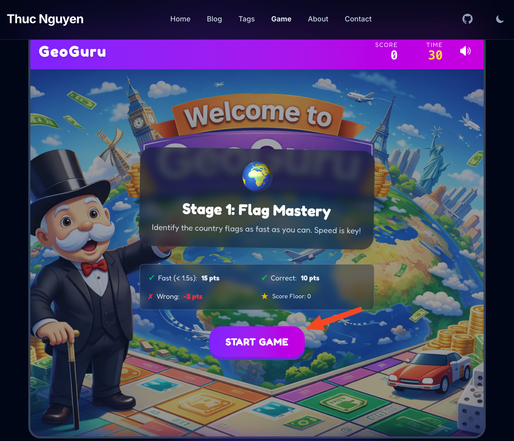
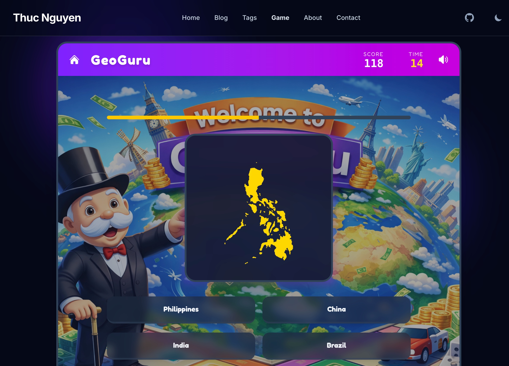
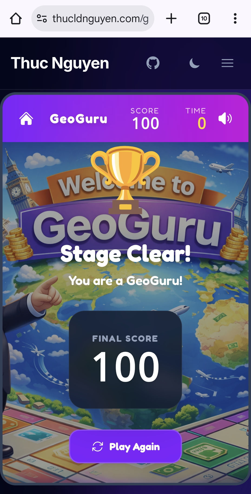

import GameCTA from '../../components/GameCTA.astro';

My childhood friend **Thuan Ho** and I used to have a lot of fun playing flag guessing games back in elementary school. So in college during a school project, Thuan and I built GeoGuru using the 'top-notch' tech stack at that time: WPF and .NET. It was a big enjoyment and we got 10/10 for the project. 

We never thought of it ever since. But last weekend, during a casual walk-down-memory-lane conversation with Thuan, I decided to test a hypothesis: **Can an AI-accelerated workflow resurrect GeoGuru and turn it into a shipped product in hours, not a whole semester?**

The result is mindblowing. AI helped me get it up and running in one morning. **[GeoGuru](/game)** is a rapid-fire game that lives right here on my site. It consists of two levels: flag guessing challenge and country shape guessing challenge.

<GameCTA />

But the text-to-code dream isn't magic, it's a dialogue. Here's a look at the real journey, the snags I hit, and how I solved them.

---
## 1. The "Easy" Logic Trap

I started out with ChatGPT to check whether static HTML sites based on Astro can host this game. Good news! It is. ChatGPT also gave me a perfect Monopoly-styled game image, and recommendations on where to download open-source soundtracks, flag images as well as country shapes to breathe life to the game.

My initial prompt for Antigravity+Gemini3Pro was rather simple: *"Build a flag guessing game but keep the code cleanly separated from existing blogs posts and image assets"* The AI obliged, writing a script to fetch 250+ country flags in .PNG format, randomize the question, calculate the score and end with a level-clear screen celebrating users' achievement. 

**The Problem**: Randomness is brutal. My first test run gave me *Tuvalu and Eswatini*, followed by *Kiribati*. I scored terribly. It wasn't fun; it was a school exam.

**The Fix**: I had to engineer "fun". I implemented a **Difficulty Progression** feature:
- **The "Easy Set"**: The first N questions *always* pull from a curated list of ~40 recognizable countries (USA, Japan, France, Vietnam, etc.). I didn't have to tell AI which ones are easy. It automatically selected and labeled them.
- **Progression**: Only after proving yourself (3 correct answers) does the game unlock the full world map with much harder questions.

This small logic tweak changed it from a frustrating quiz to an addictive loop.

---
## 2. Mobile Fails & "Liquid" UIs

I wanted the game to look "premium"—glassmorphism, vibrant gradients, 3D buttons. The AI generated beautiful Tailwind code for desktop.

**The Snag**: On mobile, it was a disaster.  
The "Start Game" button was unclickable. The "Mute" toggle was pushed off-screen. The background image cropped awkwardly, hiding the cute 3D globe assets.

**The Fix**: We (as in I and my faithful AI assistant) had to get into the weeds of responsive design.
- **Dynamic Sizing**: We shrunk the header text (`text-3xl` → `text-xl`) and tightened gaps purely for mobile constraints.
- **Fixed Containers**: We locked the game container height to stop the page from jumping around when the content changed. 

AI is great at generating *code*, but it still needs a human eye to verify *layout*.

---
## 3. The Performance Hunt

Upon first load, the game felt sluggish on my phone. The flags took a split second to pop in.

**Debugging**: I realized we were downloading glorious, high-res PNGs for every flag. Great for print, terrible for a 30-second speed game.

**The Optimization Stack**:
1.  **WebP Conversion**: We swapped all assets to WebP, cutting file sizes by ~60% (2.5KB → 1KB).
2.  **Aggressive Preloading**: This was the game-changer.
    - When you open the menu, the game *silently* downloads the top 20 "Easy" flags in the background (`requestIdleCallback`).
    - While you're staring at "Question 1", the game is already fetching the image for "Question 2"
    - I also added a logic to avoid repeat questions and made sure that when skeleton-loading the flag, the preview skeleton should not reveal the country's name (previously it simply printed out the country's name from the metadata, giving users freebies left and right)
    
The result? Zero latency. The images are just *there*.

---
## 4. The "Ghost" Button

We hit one particularly annoying bug. You'd play a round, navigate to the "About" page, come back, and... the "Start Game" button was dead. It wouldn't click.

**The Cause**: **Stale DOM References**.
Because my site uses Astro's **View Transitions** (simulating a Single Page App), the JavaScript variables were holding onto the *old* button from the previous page load. When you navigated back, a *new* button was created, but my code was still listening to the ghost of the old one.

**The Fix**: We refactored the initialization logic to freshly query the DOM every time the page swaps (`astro:page-load`), ensuring we're always wired up to the live elements.

---
## 5. AudioManager

It was my first time working with audio in web development. I downloaded a bunch of sound effects with random names and formats from the internet and asked Antigravity to add them to the game. It succeeded in one sweep, automatically recognizing that *'Night at the Beach.mp3'* is actually intended as the background music and *'confirmation.ogg'* is the sound effect for a correct answer. It even automatically assigned the correct volume levels for each.

---
## 6. Level clear screen

After all the grunt work is done, I played with GeoGuru a lot and was able to focus on polishing it. I discovered that no matter how high or low your score is, the level-clear screen always displays "Hurray you're a GeoGuru". I fixed it by asking Antigravity to add a logic to display the correct message based on the score.

My prompt was simple: 

> now add a condition for the level clear screen. If the user's score is reasonably high considering the time constraint and number of questions they got correct, show the current message "You're a Geo Guru". If their score is disappointing, show a different message (implying that their score is bad but encouraging them to retry) and icon (replacing the trophy icon by something else more appropriate).

The result was amazing! I didn't have to handhold it on what defines 'high score' versus 'low score'. It automatically picks a threshold of 120 for both levels. Better yet, the text and the new icon it generated fit my purpose perfectly. The backpack icon and "Keep travelling to improve your skills" were excellent touches. It adds humour as well as encouraging users to retry. 

---
## 7. The Asset Pipeline Challenge: Mapping the World

Once the core loop was fun, I wanted to double the content by adding **Level 2: Country Borders**. The idea was simple: show a silhouette, guess the country.

**The Reality**: It was a data nightmare.
- **Vector image processing**:Unlike flags which are readily available from flagpedia, country borders are not. I had to download a shapefile from Natural Earth, extract the geojson file, process it to get the country borders in SVG then convert them all into webp format.
- **Missing Countries**: My initial script couldn't find France or Norway. It turned out their ISO codes in the shapefile were stored in a non-standard column (`ISO_A2_EH`) because of disputed territories or dataset quirks.
- **The "Blob" Problem**: When I generated the USA, I got a tiny, unrecognizable cluster of dots. Why? Because the bounding box included Alaska, Hawaii, and Guam. The "Mainland" was just a small piece of the puzzle. The same happened for France (hello, French Guiana!) and Russia.
- **The "Squashed" Problem**: The initial SVGs looked distorted. Countries in the north (like Canada and Russia) looked extremely wide and squashed. This is a classic symptom of using a raw Equirectangular projection for screen display. I had to use a Web Mercator projection fix to make them look normal.

**The AI Solution**: instead of manually cropping 200+ images in Photoshop, I asked the AI to write a smart processing pipeline.
1.  **Smart Queries**: We updated our `ogr2ogr` scripts to check multiple data columns, ensuring every country was found.
2.  **Geometry Filtering**: We wrote a custom Node.js script using the **Shoelace formula** to calculate the area of every polygon. The script automatically identifies the "Mainland" (the largest landmass) and discards colonies or distant islands.
3.  **Automated Styling**: We piped the output through `mapshaper` to apply a unform "Yellow Fill + Black Border" style that pops against the dark UI.

In 10 minutes, we went from "broken blobs" to a perfectly centered, consistent asset library for the entire world. This is the power of AI: solving scale problems that would be tedious for a human.

---
## Final Thoughts
Building GeoGuru wasn't about typing one prompt and walking away. It was a series of rapid iterations. The AI acted as my **force multiplier**—it wrote the boilerplate, handled the math for the timer, and generated the CSS grid for the options.

This freed me up to focus on the **User Experience**: the pacing, the animations, the graphics and the "juice" (like the cheering sound effects and pop animations).

Go ahead, [give it a try](/game) and let me know if you can beat my high score below! 🌍🏆

