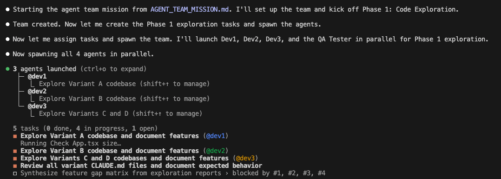
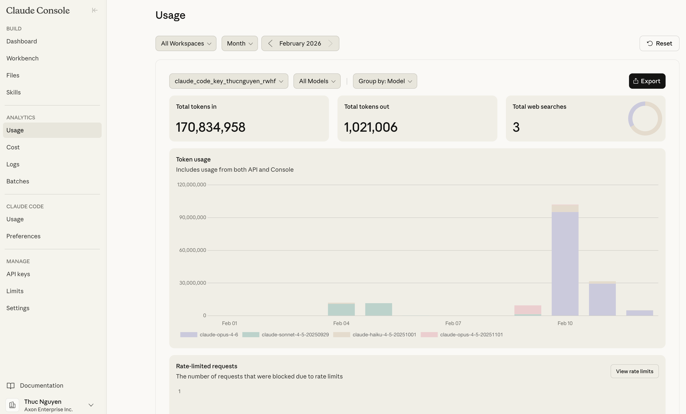
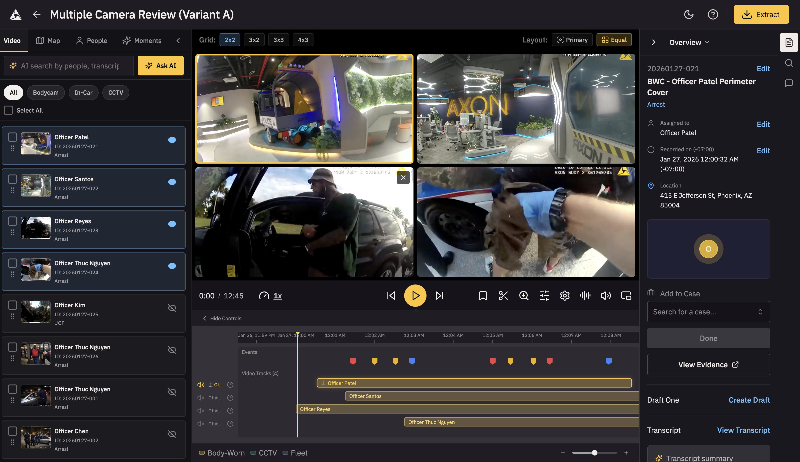
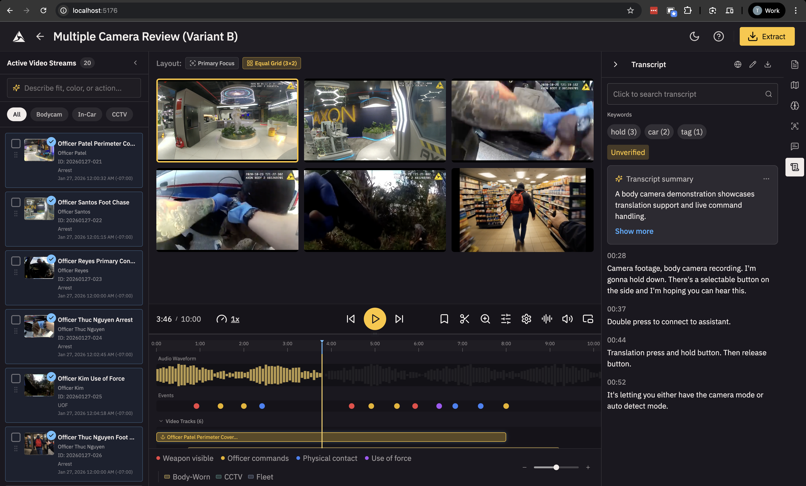
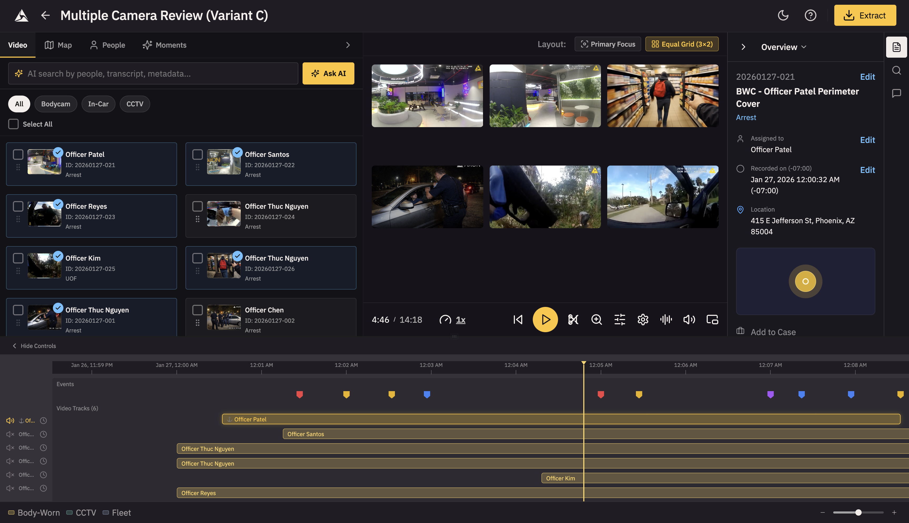
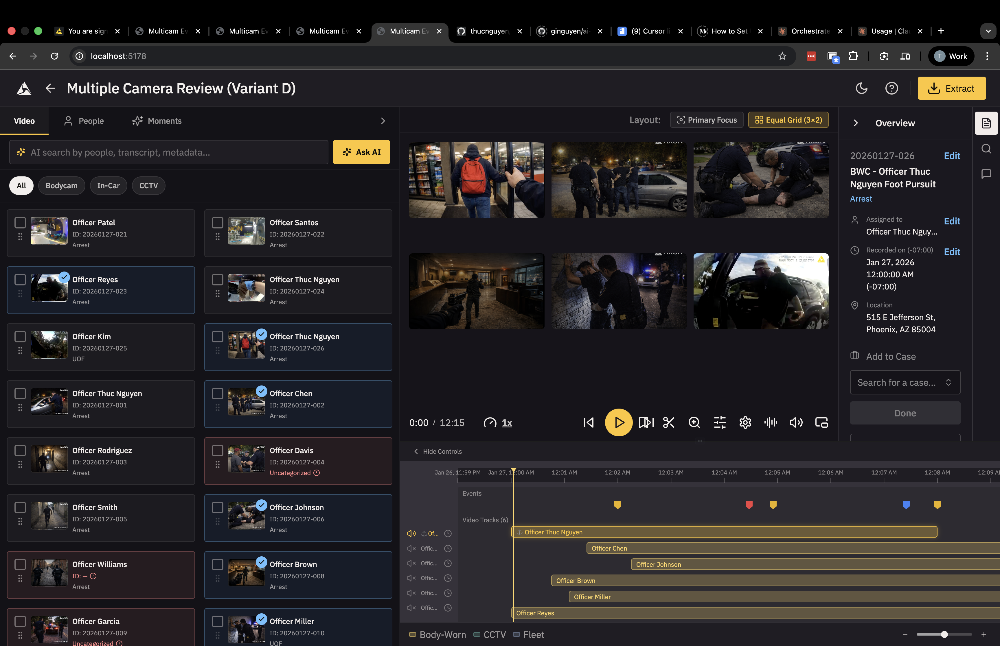

**22 minutes. 4 codebases. 1.9 million tokens. Zero questions asked.**

That's what happened when I stopped treating AI as a chatbot and started treating it as an agentic team.

*This post explores my experience with [Claude Agent Teams](https://www.anthropic.com/product/agent-teams), Anthropic's new multi-agent orchestration platform.*



---

## The Problem: Feature Parity Across 4 Design Variants

I had four design variants of a multi-camera evidence review tool that helps police detectives speed up invetigations - each ~9,000 lines of React. They'd diverged: features worked in some variants but not others. Manually syncing them would take 4-6 hours of tedious diffing.

Instead, I wrote a mission brief and deployed an AI agent team.

---

## The Team Structure

I didn't just prompt Claude. I **designed a team**:

- **1 Dev Lead** (Opus 4.6): Coordinates, synthesizes reports, creates task graphs
- **3 Developers** (Sonnet 4.5): Each owns 1-2 variants, implements features
- **1 QA Tester** (Haiku): Verifies builds, catches behavioral bugs

Each agent had a specific role, model tier, and communication protocol. The Dev Lead never wrote code—only coordinated. The QA Tester used the cheapest model (Haiku) for read-only verification. The developers worked in parallel with dependency-aware task scheduling.

---

## The Execution: Silent, Autonomous, Logged

Here's what happened, minute by minute:

### Phase 1: Parallel Exploration (90 seconds)

All four agents launched simultaneously. No sequential startup delay.

```
09:12:05  LEAD → DEV1       SPAWN: "Explore Variant A"
09:12:05  LEAD → DEV2       SPAWN: "Explore Variant B"
09:12:05  LEAD → DEV3       SPAWN: "Explore Variants C & D"
09:12:05  LEAD → QA-TESTER  SPAWN: "Review CLAUDE.md files"
```

**The QA Tester finished first** (30 seconds)—Haiku's speed advantage on read-only tasks. It immediately flagged a critical bug: Variant C was passing `demoEvents` (all events, unfiltered) instead of `activeEvents` (filtered by currently loaded videos). This one-line bug would've shown users events from videos they hadn't even loaded—a production-breaking oversight.

Dev3 also spotted this discrepancy, but framed it as a code difference rather than a behavioral bug. The QA Tester's behavior-first lens made it immediately actionable.

**Dev3 produced a comparison table** instead of two separate reports. This single decision saved 10+ minutes of manual diffing. The Dev Lead's gap matrix was essentially a merge of Dev3's table with the other reports.

### Phase 2: Gap Analysis (46 seconds)

The Dev Lead synthesized all four reports into a feature gap matrix:

| Feature         | A   | B   | C   | D   |
| --------------- | --- | --- | --- | --- |
| Canonical data  | ✓   | ✗   | ✗   | ✗   |
| Search syntax   | ✓   | ✗   | ✗   | ✓   |
| Event filtering | ✓   | ✓   | ✗   | ✓   |
| Metadata tabs   | ✓   | ✓   | ✓   | ✗   |

Six implementation tasks created. Dependency chain established: data porting before search porting (because search operates on data). No agent ever hit a merge conflict.

With the roadmap clear, the developers got to work.

### Phase 3: Implementation (17 minutes)

Developers worked in parallel. Every decision was logged:

```
09:20:15  DEV2 → LEAD  DONE: Task #10 — data ported to B
                       (titles, categories, locations, timezones updated)
09:20:28  DEV2 → LEAD  DONE: Task #12 — searchStreams() ported to B
                       (the search function that filters camera feeds by query)
```

**An unexpected collision happened**: Dev1 autonomously picked up Task #15 (add metadata tabs to Variant D) while Dev2 was being reassigned to it. Duplicate work?

No—**accidental peer review**. Dev2 arrived second and verified Dev1's implementation: build passed, all 3 tabs worked, layout preserved. A race condition turned into a quality gate.

### Phase 4: QA Verification (60 seconds)

The QA Tester ran `npm run build` in all four directories. 4/4 builds passed. 7/8 spot-checks passed. One false alarm (pre-existing uncommitted changes in Variant A).

**One limitation**: QA validated structural correctness (builds pass, right code in right files) but not runtime behavior. No browser was launched, no UI was visually inspected, and no interactive testing was performed. Browser-based testing would require additional tooling like Playwright.

Total wall clock: **22 minutes** from team creation to shutdown.

---

The mission was complete. Here's how it stacked up:

## The Numbers That Matter

| Metric                  | Value      |
| ----------------------- | ---------- |
| **Wall clock time**     | 22 minutes |
| **Estimated solo time** | 4-6 hours  |
| **Speedup**             | ~12x       |
| **Total tokens**        | ~1.9M      |
| **Estimated cost**      | $15-25     |
| **Build failures**      | 0          |
| **Merge conflicts**     | 0          |

#### Cost Breakdown Surprises

**Dev1 was the most expensive agent** (~740K tokens) despite completing fewer tasks. Why? Variant A had a 1,585-line `App.tsx` that required extensive reading. Context is expensive.

**The QA Tester cost 5-10x less** (~85K tokens) than the developers. Read-only tasks don't need the most capable model.

---

## Four Insights That Changed How I Think About AI

### 1. Comparative Outputs > Independent Reports

When Dev3 explored Variants C and D, they produced a **side-by-side comparison table** instead of two separate inventories. This single decision made the gap identification trivial. The Dev Lead's task list was generated in under 60 seconds.

**Takeaway**: When agents explore related codebases, instruct them to produce diffs, not documents.

### 2. The Cheapest Model Surfaced the Most Critical Bug

The QA Tester (Haiku) was the first to finish and framed the `demoEvents` vs `activeEvents` discrepancy as a behavioral bug (while Dev3 noted it as a code difference). The developers focused on "does this component exist?" The QA Tester focused on "does this component behave correctly?"

**Takeaway**: Read-only QA/analyst roles catch different classes of bugs than implementers. Assign QA agents to behavior-first analysis, not code inventory.

### 3. Accidental Peer Review Is a Feature, Not a Bug

When Dev1 and Dev2 both completed Task #15, I thought I'd wasted tokens. But Dev2's verification confirmed the implementation was correct without requiring a full QA cycle. The cost of reading and verifying is much lower than implementing.

**Takeaway**: Build verification into the task graph explicitly. Create paired tasks: "Implement X" (Dev A) + "Verify X" (Dev B).

### 4. Inter-Agent Communication > Silent Subagents

This is where Claude Agent Teams truly shines compared to traditional silent subagents. With silent subagents, each developer would have reinvented the wheel independently. Here's what changed:

```
09:20:28  DEV2 → LEAD        DONE: Task #12 — searchStreams() ported to B
09:20:28  LEAD → DEV3        FYI: Dev2 just implemented search for B.
                             Key pattern: field=value syntax, 300ms debounce.
                             See handleSearch() for reference.
09:31:01  DEV3 → LEAD        DONE: Task #13 — used Dev2's pattern for C.
                             Adapted for C's hideHeader prop.
```

The Dev Lead actively **shared knowledge** between agents. Dev3 didn't have to reverse-engineer Dev2's approach—they got a direct handoff. This prevented duplicate work and ensured consistency.

**Takeaway**: Agent Teams with explicit communication protocols catch cross-cutting concerns that silent subagents miss. The coordination overhead is worth it.

---

## What This Means for Product Managers

Here's the thing: **I didn't write a single line of code in this session**. I wrote a mission brief.

The skills that mattered:
- **System design**: Structuring the team hierarchy and communication protocol
- **Task decomposition**: Breaking the problem into parallelizable chunks
- **Dependency mapping**: Ensuring data flows in the right direction
- **Quality gates**: Designing verification into the workflow, not bolting it on after

These are **PM skills**. The AI did the implementation.

---

## Lessons Learned (What I'd Do Differently Next Time)

1. **Integrate Playwright for real browser testing** — The QA agent only ran builds and grepped files. Next time, I'll add browser automation to test interactive workflows, verify layouts, and catch runtime errors.

2. **Add git commit checkpoints for rollback safety** — All changes sit uncommitted. Next time, the mission plan should include commit checkpoints after each task completion to create restore points.

3. **Prevent duplicate work with explicit task ownership** — Dev1 and Dev3 both completed Task #11 independently, wasting ~500K tokens. Next time, add a "check TaskList before starting" instruction and make the Dev Lead send explicit ownership updates.

4. **Proactively reassign idle agents** — Dev1 was underutilized after Phase 1. Next time, build agent utilization monitoring into the Dev Lead's responsibilities to immediately assign finished agents to verification or next tasks.

---

## The Future Is Weirder Than You Think

We're not heading toward "AI replaces engineers." We're heading toward "PMs who can orchestrate AI teams ship faster than traditional engineering teams."

The bottleneck isn't coding anymore. It's **knowing what to build and how to structure the work**.

If you're a PM who thinks AI is just ChatGPT for writing PRDs, you're already behind. The people who win in the next 3 years are the ones who learn to:
1. Write mission briefs, not prompts
2. Design task graphs, not to-do lists
3. Instrument workflows with verification gates
4. Treat AI as a team, not a tool

> NOTE: Be mindful about token consumption as agent teams can burn millions of tokens in a single session. Always monitor the token usage and optimize the workflow to reduce unnecessary token consumption. I spent 100M tokens (approx $500) in one previous session (12-Feb-2026) due to a "UX Expert" agent that ate up too many tokens just to answer design system questions via a Figma MCP. Better optimize visuals in a separate session outside of the team session.



---

## Appendix: The Four Variants

For those interested in the UX design decisions behind each variant:


*Variant A uses a classic 3-panel layout: Library (left) | Grid+Timeline (center) | Metadata (right). This layout optimizes for investigators who need constant access to metadata while building their multicam view—perfect for detailed case review where context switching is expensive.*


*Variant B mirrors Variant A's structure but with unique behaviors (drag-dropping videos to the video grid instead of toggling each video on/off via Eye icons) and component implementations and a 6-tab support pane. This variant tests whether power users prefer more granular control panels (separate tabs for different metadata types) versus Variant A's consolidated metadata view.*


*Variant C takes a horizontal split approach: Library and Grid sit side-by-side at the top, with a full-width Timeline below, similar to professional video editing software like iMovie and CapCut. This layout is designed for users who prioritize reconstructing the sequence of events chronologically. The main trade-off is that the metadata panel is hidden by default, requiring an extra click to access—ideal for users who want to focus on the timeline first and only dive into metadata when needed.*


*Variant D is similar to variant C - users drag drop videos onto the timeline instead of the video grid. Key difference is that the video library on the left is more prominent, spanning the entire height of the page.*

---

**Questions? Challenges? Want to collaborate?** I'm always up for talking about agentic AI, product development, and the weird future we're building. Let's connect.
