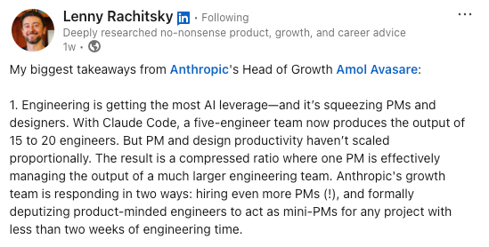

## TL;DR

**Three days. Two PRs merged.**

Leadership announced on Mar 26 that every Product Manager in my department should ship 2 PRs by Jun 30. I merged both of mine on Mar 29, **3 days** after the announcement and **3 months** ahead of the deadline.

As a PM, merging those 2 PRs felt amazing. Not because the code was especially hard. It wasn’t.

What mattered was getting real fixes through a real production process, at a company where the bar is high and the blast radius is global.

Takeaway: code generation is the easy part now. Judgment, testing rigor, and choosing the right problem are the hard parts.

---

## The Bugs Were Small. The Friction Wasn’t.

Both PRs fixed annoying UI issues in our Axon Evidence media player.

- One suppressed persistent tooltips that kept getting in the way when users tried to edit clips or markers in evidence videos.
- The other fixed a bug in the media player's Full Screen mode that had been overlooked by a sister team.

Users feel that kind of friction immediately.

---

## AI Made Coding Easy. It Didn’t Make Shipping Easy.

I used Claude Opus 4.6 with 1M context which was fantastic. The long context window made it easy to stay in flow, understand the codebase, and get to a working fix quickly.

But writing the code was the easy part. Testing was the hard part.

At Axon, PR review bots are strict. And for good reason. We ship to production environments across the US, UK, Canada, Latin America, Australia, and more. When the stakes are that high, “it works on my machine” means nothing.

Shipping is not just generating code. Shipping is surviving rigor.

---

## PMs Should Pass the Fitness Test

I honestly believe that PMs should be able to ship a real change to production whenever needed.

That skill is increasingly valuable, especially in startups or on teams where engineering capacity is the bottleneck. If you can fix a paper cut yourself, unblock a small issue, or validate an idea without waiting in line, that’s real leverage.

PMs should pass that fintness test.

## But Don't Become a Discount Engineer

Here’s the boundary: if a PM is shipping code all day, every day, they should probably be replaced by an actual engineer.

PMs should be comfortable coding. But they should not spend their highest-value hours pretending to be full-time engineers. That is not where the leverage is.

---

## The Human Edge Still Wins

That's why I still jump on late-night customer calls 3–4 times a week.

Those customer calls are where the real product signal comes from: where users hesitate, what they ignore, and what slows them down under pressure. That context is what tells you *which* problems worth solving now versus later.

AI can write code. It still can’t build trust with users or extract messy human context the way direct human contact can.

---

## The Ratio is Breaking.

AI makes it easier to build fast. That makes problem selection more important, not less.

Solving the wrong problem quickly is still failure.

This is why the PM-to-engineering ratio of 1:5 is officially broken. Engineering output is being amplified faster than PM/design output. 

Lenny captured this well in his recent conversation with Anthropic’s Head of Growth, Amol Avasare: [LINK](https://www.linkedin.com/posts/lennyrachitsky_my-biggest-takeaways-from-anthropics-head-activity-7446932397385818112-QFR8)

That matches what I'm seeing.

**Speed Is Cheap. Judgment Is Not.**

My take: PMs are not becoming less important. We’re becoming more of the bottleneck.

The new bar is clear: be technical enough to earn leverage, and disciplined enough to choose the right problem.

## Embrace AI Aggressively

I've recently checked my Claude usage to make sure I was using AI aggressively *and* responsibly.

My April Claude usage month to date is about $696, which is still within Axon's $1,000/mo budget.

Most PMs are not expected to spend hundreds of millions of tokens every month like engineers. But if you're a PM and you're spending $5 out of a $1,000 monthly cap, you have a serious adoption problem.

Don’t overspend. But don’t underuse the leverage either.
