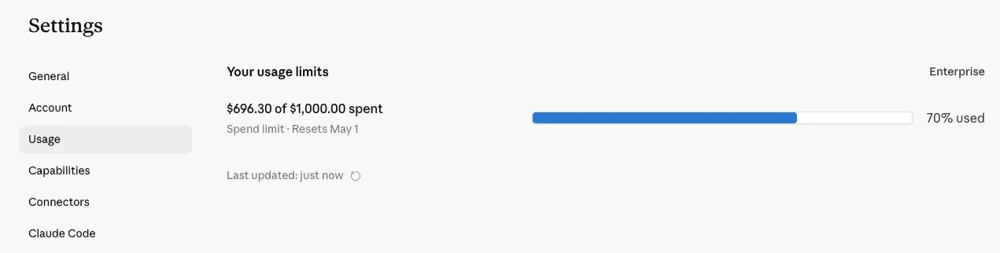

## Synopsis

Leadership announced on **March 26** that every PM should ship **2 PRs by June 30**. I merged both of mine to production on **March 29** — just 3 days later, and roughly 3 months early.

The lesson wasn’t “PMs should become engineers.” It was this: AI makes code generation faster, but the hard part is still judgment, rigor, and choosing the right problems.

For broader context on how AI is changing PM-to-engineering dynamics, see [Lenny’s summary of his conversation with Amol Avasare](https://www.linkedin.com/posts/lennyrachitsky_my-biggest-takeaways-from-anthropics-head-activity-7446932397385818112-QFR8).

---

Merging those 2 PRs felt great.

Not because the code was especially hard. It wasn’t.

What mattered was getting real fixes through a real production process, at a company where the bar is high and the blast radius is global.

---

## The Bugs Were Small. The Friction Wasn’t.

Both PRs fixed annoying UI issues in our media player.

- One fixed a bug that had been overlooked by a sister team.
- The other removed persistent tooltips that kept getting in the way when users tried to edit clips or markers in evidence videos.

These were not glamorous problems. But they were real. And users feel that kind of friction immediately.

---

## AI Made Coding Easy. It Didn’t Make Shipping Easy.

I used Claude Opus 4.6 with 1M context, which was fantastic. The long context window made it easy to stay in flow, understand the codebase, and get to a working fix quickly.

For context: Axon gives us a $1,000 monthly Claude cap. I’m at about $696 in April, which is still within budget.

Most PMs won’t spend as much as engineers, and that’s fine. But if you’re spending $2 out of $1,000 every month, you probably don’t have a cost problem — you have an adoption problem.

As a PM, don’t overspend. But don’t underuse the leverage either. The bar is an AI-first mindset applied everywhere it meaningfully improves speed, quality, or learning.

But writing the code was the easy part. The hard part was testing.

At Axon, the PR review bots are strict. And for good reason. We ship to production environments across the US, UK, Canada, Latin America, Australia, and more.

When the stakes are high, “it works on my machine” means nothing.

Getting code to prod is not just about generating code. It’s about surviving the rigor around it.

---

## PMs Should Pass the Fitness Test

I think PMs should be able to ship a real change to production when needed.

That skill is increasingly valuable, especially in startups or on teams where engineering capacity is the bottleneck. If you can fix a paper cut yourself, unblock a small issue, or validate an idea without waiting in line, that’s real leverage.

PMs should pass that fitness test.

---

## But Don’t Become a Discount Engineer

Here’s the boundary: if a PM is shipping code all day, every day, they should probably be replaced by an actual engineer.

PMs should be comfortable coding. They should not spend their highest-value hours pretending to be full-time engineers.

That is not where the leverage is.

---

## The Human Edge Still Wins

The real edge of a PM is still human:

- talking to customers,
- understanding pain deeply,
- noticing patterns,
- choosing the right problems.

That’s why I still jump on late-night calls with customers 3 to 4 times a week.

AI can write code. It cannot build trust with users or understand messy human problems the way direct contact can.

---

## The Ratio Is Breaking

This shift is bigger than my 2 PRs.

Lenny summarized a recent conversation with Anthropic’s Head of Growth, Amol Avasare, in a way that really clicked for me: engineering is getting the most AI leverage, and it’s squeezing PMs and designers.

A 5-engineer team can now produce something closer to the output of 15 to 20 engineers, while PM and design productivity haven’t scaled proportionally. The result is a much more compressed PM-to-engineering ratio.

Anthropic’s response is not fewer PMs, but more PMs, plus product-minded engineers acting as mini-PMs on smaller projects.

That matches what I’m seeing.

PMs are not becoming less important. If anything, we’re becoming more of the bottleneck.

---

## Speed Is Cheap. Judgment Is Not.

AI makes it easier to build fast. That makes problem selection more important, not less.

It is useless to solve the wrong problem quickly.

That’s the new bar for PMs: be technical enough to earn leverage, but stay focused on the work that matters most.

Choosing the right problem, fast, has never been more important.