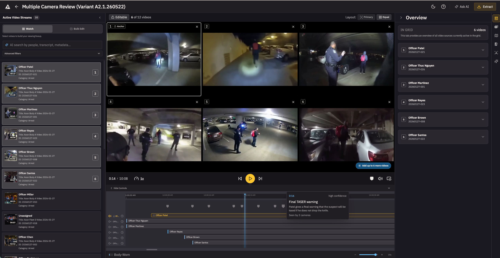
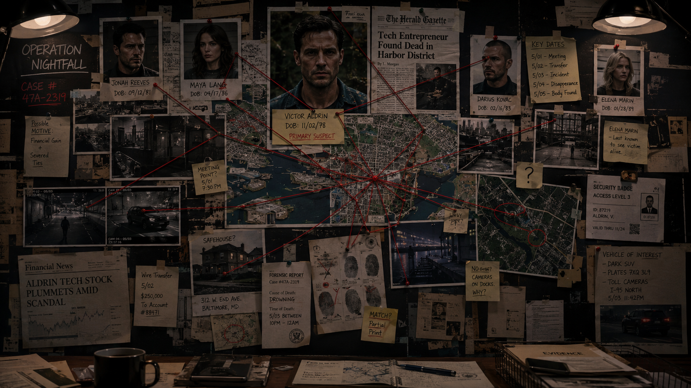
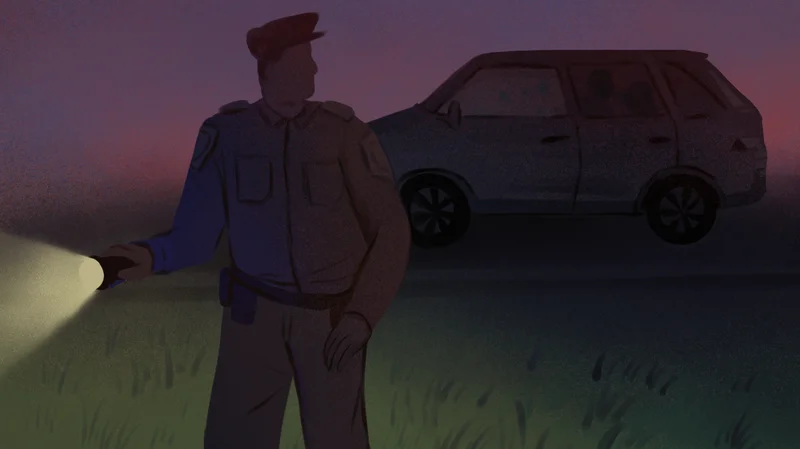

Policing has come a long way on evidence capture and storage.

Now a different challenge emerges: help humans find what matters inside an ever-growing flood of evidence.

Digital evidence now shows up in roughly [90% of criminal cases](https://pmc.ncbi.nlm.nih.gov/articles/PMC10311201/). One Colorado DA office went from [24,000 hours of video in 2022 to 41,000 in 2025](https://www.cpr.org/2026/01/02/overwhelming-digital-evidence-body-cam-footage/). A single routine vehicular homicide can generate [90 hours of body-worn and dashcam footage](https://www.cpr.org/2026/01/02/overwhelming-digital-evidence-body-cam-footage/).

Consider the math. Even at 2x speed, that is 45 hours of scrubbing to find the 2-3 minutes that matter in court. That ratio is the problem.

The next era of policing is not defined by a shortage of evidence. 

Instead, a crazy amount of it.

**Investigations are shifting from humans analyzing evidence to humans verifying AI findings.**

The investigator of the future will not start by watching everything. They will start by asking:

- **What should I look at first?**
- **What is most likely connected?**
- **What did we miss?**

That is where I think evidence playback on Axon Evidence (evidence.com) is going.

## 1. AI triage: not "summarize this case," but "show me what to watch first"

Multi-camera incidents are still brutally manual.

Five officers respond to one scene. All five record overlapping slices of the same event. The investigator scrubs each one, guesses which angle matters, and mentally stitches a timeline. Hours of human labor.

A smart system would let them ask:

- Which recordings cover the 90 seconds before the foot pursuit?
- Show me the clearest angles of the use-of-force moment
- Which videos capture the suspect's right hand before the weapon appears?

Most of this is buildable today with timestamp correlation, metadata, and transcript search. The cutting edge is visual understanding — was the black blob in the suspect's hand a phone or a gun? Vision models are getting cheap enough, fast enough, that running them at scale is months away, not years.

This is not an AI gimmick. It is a triage layer for high-volume incidents — use-of-force reviews, officer-involved shootings, mass protests.

The wrong starting point is "AI understands all your evidence." That means running expensive vision models across every frame — most of which is routine patrol, transport, or dead air. Bad economics.

The right version indexes cheaply everywhere — metadata, timestamps, transcripts, camera-officer linkage, overlap detection — and reasons deeply only when the case earns it: a serious incident, an investigator query, a prosecutor preparing for trial.

The goal: **cut time-to-first-relevant-clip from hours to minutes**.

Sounds simple. It is a big shift in product philosophy. Most evidence systems still assume the user knows where the answer lives. In real investigations, they often do not.

## 2. The evidence graph: from files and folders to entities and relationships

This is the bigger leap.

Most digital evidence products still think like storage systems. File here, clip there, metadata over there, search box on top. That worldview is running out of road.

Investigators do not think in files. They think in **people, places, vehicles, weapons, events, claims, and contradictions**. The system should too.

Imagine an evidence graph that maps entities — suspects, officers, victims, witnesses, vehicles, addresses, phones — and the relationships between them.

Now the search experience changes:

- Show me every evidence item tied to this vehicle and this address within 48 hours
- Which witnesses appear in incidents involving this suspect?
- What evidence clusters around this firearm across cases?

A shift from **finding files** to **understanding relationships**.

The data already exists in isolation — case linkage, officer assignments, CAD dispatch, RMS entries. It just lives in separate systems. The evidence graph is not inventing new data. It is making existing data talk.

Investigations are not about isolated facts. They are about drawing connections — the red-string kind on every detective's board — until the picture is coherent enough to act on and rigorous enough to defend in court.

The hard part is accuracy. Entity resolution across messy police data — misspellings, aliases, partial DOBs — is genuinely difficult. In public safety, a false link is not a bad search result. It is a civil rights problem. The system has to be honest about confidence and keep a human in the loop on every connection.

What makes the evidence graph more than a research project: most investigative triage does not need deep video understanding at all. Metadata, transcripts, timestamps, entity linkage, and CAD/RMS joins capture most of the signal. Vision models matter for the hard queries — "show me the clearest angle of the suspect's hand" — but the graph does the heavy lifting long before frame-level inference is needed.

The platform that already holds the evidence, the metadata, and the chain of custody is best positioned to build this. The graph is not a separate product. It is the next layer on top of an evidence platform agencies already trust.

## 3. The quiet agent in the background

The most important AI in public safety may end up being the least flashy.

Chatbots that answer policy questions are useful. Transcript summaries save real time. But the next breakthrough is quieter — an Investigative Assistant that works in the background, connects dots across newly arriving evidence, and taps the investigator on the shoulder when something matters.

Concretely: a new video uploads to Case #4471. The transcript mentions "Marcus." The system already knows Marcus Williams is a person of interest in Case #3892 from last month. The assistant notifies the investigator on #3892: *"A new video in an unrelated case mentions a name matching your POI. Review?"*

Not science fiction. Transcript search plus entity matching plus a notification layer. The ingredients exist. What does not exist is a system that runs the check continuously, across cases, without being asked.

Humans are bad at re-scanning the whole graph every time new material arrives. Machines are good at exactly that.

The obvious risk: alert fatigue. Too many notifications and investigators tune out. The bar for interruption has to be high, tunable, and transparent about why it fired. The worst version is a feed nobody reads. The best version is a tap on the shoulder at exactly the right moment.

The best investigative AI will not just answer questions. It will know when to interrupt with a better one.

## 4. A system that can escalate before the report is filed

One California story has stayed with me.

In a [KQED investigation](https://www.kqed.org/news/11878379/neglect-of-duty) headlined *Neglect of Duty*, an officer encountered a missing 14-year-old girl in a car with a 23-year-old man. He did not write a report, did not investigate, did not arrest the man for statutory rape. The girl had developmental and learning disabilities — her school psychologist put her mental capacity at 8.5 years old. She was being exploited by an adult, and the one person who could have intervened did nothing.

Horrifying on its own. Also a product lesson.

Too many systems still assume a police report is the start of the investigative workflow. Sometimes the report is late. Sometimes it is thin. Sometimes it never comes.

What if the system did not wait?

The feasible version starts with transcripts. If a newly uploaded video's transcript matches an active missing persons case — a name, a case number, a location — the system flags it before a report is written.

**This video likely contains information tied to an at-risk person. Review now.**

Buildable today with transcript search and entity matching. Harder capabilities — face matching against victim databases, cross-referencing prior abuse records — arrive later. But the transcript trigger alone could have changed the outcome in stories like that one.

This is the most legally sensitive idea in this post. If the system flags something and nobody acts, the platform may share liability. If it fails to flag, same problem. Any team building this designs the escalation model with legal and compliance from day one, not bolted on after.

Not a reason to avoid it. A reason to build it carefully.

Not "store first, investigate later."

"Listen early, escalate early."

## 5. Most "AI for public safety" is still aiming too low

Most AI in this category still feels like workflow garnish.

Transcribe the audio. Summarize the clip. Generate the report. Add a chat box. Add a voice command.

Some of it is useful. None of it is the main event.

Even recent public safety AI rollouts from large vendors emphasize [analytics, voice controls, AI chat for chart generation, and automated reporting](https://www.oracle.com/news/announcement/oracle-enhances-public-safety-suite-for-real-time-data-intelligence-2025-10-20/). That improves workflow at the edges. It does not solve evidentiary reasoning across a messy case.

The difference: a detective reviewing a gang shooting today gets a transcript and a summary. That helps. It does not tell her the same vehicle in this footage appeared in a drive-by three weeks ago, that a witness here gave a contradictory statement in that earlier case, or that the firearm matches a description from an unsolved robbery. That is the gap between summarizing evidence and reasoning about it.

The future does not belong to the product with the prettiest summary.

It belongs to the product that helps investigators get to the **right doubt** faster.

A weak system helps you consume more evidence.
A good system helps you ignore more of it.
A great system helps you notice what is missing.

That is the standard I care about.

## 6. The job of the human gets smaller and more important

None of this means the machine solves the case.

It means the machine does more of the first-pass cognitive labor, while the human spends more time on what humans are actually good at: skepticism, contextual judgment, ethical restraint, deciding what stands up in court.

The future investigator does not look less important. They look more leveraged.

Less time retrieving.
Less time scrubbing.
Less time guessing where to start.

More time verifying.
More time challenging the machine.
More time answering the only question that matters:

**What actually happened?**

The last decade in public safety was about capturing everything. The next decade is about knowing what deserves attention first.

The starting point is narrow: AI-assisted triage for multicam critical incidents. The destination is an evidence platform that reasons. The gap between them is where the most important product work in public safety happens over the next five years.
